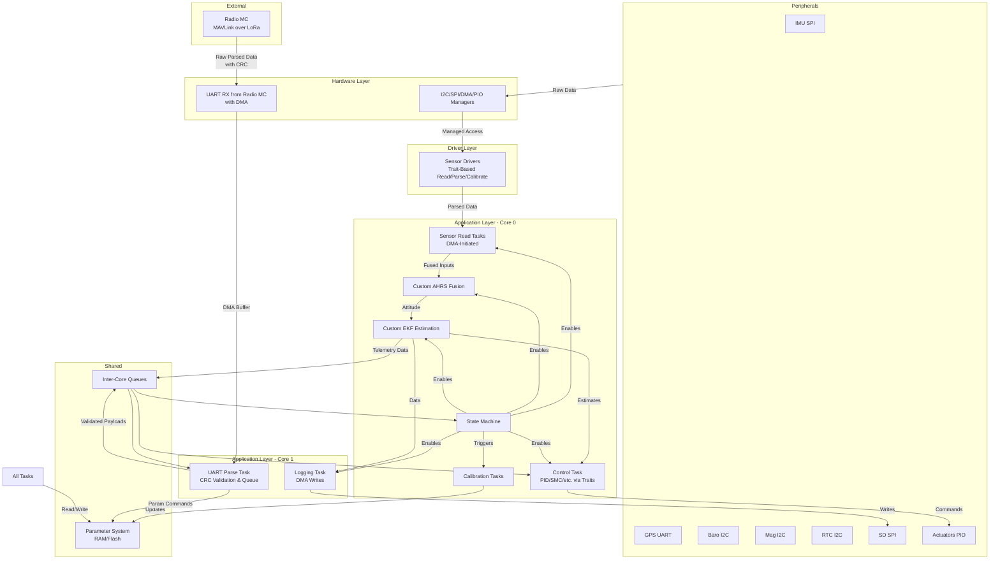

# High-Level Design Document for RP2350-Based UAV Flight Computer Firmware

## Document Overview

This document furnishes a comprehensive high-level design for the firmware of an unmanned aerial vehicle (UAV) flight computer employing the RP2350 microcontroller, designated as the Raspberry Pi Pico 2. Intended for embedded programmers, it delineates the architecture, operational principles, functionality, features, and strategies for mitigating errors arising from Rust's ownership model, peripheral interfaces such as I2C, SPI, UART, and PIO, dual-core processing, and associated technologies. The design enforces a restriction against external libraries beyond RTIC for real-time task management, mandating native Rust implementations for components including the Attitude and Heading Reference System (AHRS) and Extended Kalman Filter (EKF). This methodology exploits Rust's ownership paradigm to bolster safety and concurrency, while optimizing the RP2350's hardware attributes, encompassing dual Cortex-M33 cores (configurable as RISC-V), hardware floating-point unit (FPU), digital signal processing (DSP) instructions, 520 KB SRAM, and programmable I/O (PIO) blocks.

The firmware operates within a no_std environment, utilizing the rp235x-hal crate for hardware abstraction. As of July 18, 2025, rp235x-hal delivers stable support for RP2350 peripherals, incorporating recent enhancements for GPIO reliability and PIO programming, as documented in the RP2350 datasheet (version dated August 8, 2024). The system derives inspiration from open-source initiatives such as madflight, ArduPilot, and Betaflight, adapting their modular frameworks while exceeding them in safety through Rust's compile-time validations and in performance via RP2350-specific optimizations.

Communication responsibilities, including MAVLink encoding and decoding over LoRa, are delegated to a separate microcontroller (Radio MC), allowing the RP2350 flight computer (FC) to concentrate exclusively on core flight operations. Data exchange between the Radio MC and FC occurs via UART with cyclic redundancy check (CRC) for integrity verification, ensuring robust, non-blocking transfers without encumbering the FC's dual cores.

Key objectives encompass attaining exceptional flight smoothness via extensible control algorithms, rigorous telemetry validation, and phased development incorporating optimization cycles. During the telemetry-only phase, testing will integrate an ArduPilot drone, facilitating data monitoring through a ground station while the Radio MC manages MAVLink interactions.

## System Requirements and Assumptions

- **Hardware**: RP2350 microcontroller interfacing with sensors via I2C (BMP388 barometer, LIS3MDL magnetometer, PCF8563 RTC), SPI (BMI088 IMU, SD card), and PIO for actuators (e.g., servos). A separate Radio MC handles LoRa communications, connected to the FC via UART for raw data transfer.
- **Software Environment**: Rust no_std toolchain, RTIC for task scheduling, rp235x-hal for HAL. No additional crates; custom fixed-point mathematics for DSP utilization.
- **UAV Applications**: Drones, rockets, RC planes, emphasizing initial telemetry precision prior to control activation.
- **Communication Protocol**: MAVLink managed exclusively by the Radio MC for ground station interactions. UART between Radio MC and FC employs custom framed binary packets with CRC (e.g., CRC-16-CCITT) for data integrity, containing pre-parsed commands or telemetry payloads.
- **Performance Goals**: Sub-millisecond control loop latency, <5% CPU utilization for sensor/estimation tasks via DMA/PIO, and resilient operation with fault tolerance.

## Firmware Architecture Overview

The firmware adopts a three-layer structure to foster modularity and maintainability:

1. **Hardware Layer**: Interfaces with rp235x-hal for peripheral governance, administering configurations and shared resources, excluding communication peripherals now delegated to the Radio MC.
2. **Driver Layer**: Abstracts sensor interactions through traits to address Rust ownership constraints.
3. **Application Layer**: Coordinates RTIC tasks across dual cores (Core 0 for estimation/control, Core 1 for logging and UART reception from Radio MC), incorporating the state machine, parameter system, AHRS/EKF, and control logic.

This architecture prioritizes real-time execution, with both cores dedicated to flight-critical functions. The Radio MC processes MAVLink packets, forwarding parsed data (e.g., commands) to the FC via UART with CRC-protected frames.

### How the Architecture Works

- **Initialization**: Upon boot, the hardware layer configures pins, DMA channels, and PIO state machines via rp235x-hal. Shared resources (e.g., I2C bus) are enrolled in RTIC for late binding. UART for Radio MC interface is set up with DMA for reception.
- **Data Acquisition**: Sensor drivers borrow buses momentarily, commencing DMA transfers for SPI devices. Raw data undergoes parsing with parameter-derived calibrations.
- **Estimation and Control**: Core 0 executes AHRS for quaternion fusion and EKF for state estimation. Control tasks utilize these outputs to generate actuator commands via PIO.
- **Communication and Logging**: Core 1 manages SD card logging via DMA and receives UART data from the Radio MC, verifying CRC and queuing parsed payloads (e.g., mode change commands) for Core 0.
- **State Management**: The state machine regulates transitions, activating tasks according to modes (e.g., sensors only in TelemetryOnly).
- **Parameter Interaction**: Flash-stored parameters load to RAM, with updates from Radio MC-forwarded commands influencing operations like EKF covariances.
- **Error Handling**: RTIC priorities avert interrupt disputes; ownership secures exclusive bus access.

The Radio MC independently handles LoRa interactions, encoding/decoding MAVLink, and forwards validated, CRC-appended raw data to the FC's UART, ensuring the FC remains unburdened by protocol overhead.

### Functionality and Features

- **Core Functionality**:
  - High-frequency sensor acquisition (IMU at 100 Hz) with DMA offload.
  - AHRS for quaternion-based attitude computation, EKF for integrated state estimation (position, velocity, orientation).
  - Logging to SD card (configurable 1-50 Hz) with RTC timestamps.
  - Actuator governance via PIO PWM for servos/motors.
  - UART reception of raw data from Radio MC, with CRC validation for integrity.

- **Advanced Features**:
  - Extensible flight modes (Stabilize, Hover, Loiter, Freestyle) through trait-based control, modeled after ArduPilot.
  - Parameter system for runtime adjustments (e.g., EKF activation, filter thresholds), with validation and flash persistence.
  - Calibration procedures for sensors, persisting biases/scales in parameters.
  - Telemetry-only mode for validation, with Radio MC relaying data to ground stations via MAVLink.
  - Provisions for advanced algorithms (e.g., IEKF, SMC) selectable via parameters.

- **Safety and Reliability**:
  - Watchdog timers in RTIC for hang detection.
  - CRC verification on UART packets from Radio MC to mitigate corruption.
  - Low-power modes in Recovery leveraging RP2350's sleep capabilities.

### Error Prevention Measures

Embedded systems on RP2350 encounter challenges from Rust's ownership, peripheral disputes, and hardware specifics. Mitigation strategies include:

- **Rust Ownership/Borrowing in no_std**: Employ UnsafeCell in bus managers for mutable access, safeguarded by RTIC's single-threaded execution. Traits enforce compile-time borrowing, averting data races. Pin buffers in RTIC resources to prevent use-after-free in DMA contexts.
- **I2C Conflicts**: Manager guarantees exclusive access; incorporate timeouts and recovery (e.g., clock stretching handling) for stuck slaves, per rp235x-hal guidelines.
- **SPI/DMA Issues**: Share DMA channels via traits; completion interrupts invoke tasks, with status inspections addressing RP2350 FIFO overflows.
- **UART from Radio MC**: DMA for reception; CRC (e.g., CRC-16) validation in receive tasks discards corrupted frames. Baud rate synchronization prevents overruns; queues buffer data to avoid blocking.
- **RP2350 Dual-Core Pitfalls**: RTIC core affinity precludes cross-core races; atomic operations for shared SRAM params.
- **LoRa/MAVLink Delegation**: Radio MC isolation prevents FC exposure to radio noise or packet errors; UART CRC adds redundancy.
- **General**: Compile-time pin conflict checks; runtime health assessments via params terminate unsafe states.

## Visual Roadmaps for Data Flow

### Overall Data Flow Diagram



### UART Data Flow Between Radio MC and FC

```mermaid
sequenceDiagram
    participant RadioMC as Radio MC
    participant FCUart as FC UART (DMA RX)
    participant FCParse as FC Parse Task (Core 1)

    RadioMC->>FCUart: Send Framed Packet (Header + Payload + CRC)
    FCUart->>FCUart: DMA Transfer to Buffer
    FCUart->>FCParse: Completion Interrupt
    FCParse->>FCParse: Verify CRC
    alt Valid CRC
        FCParse->>FCParse: Extract Payload (e.g., Command Struct)
        FCParse->>Queues: Queue for Core 0 (e.g., Mode Change)
    else Invalid
        FCParse->>Log: Log Error; Discard
    end
    Note over RadioMC,FCParse: Payloads are pre-parsed; no MAVLink in FC
```

## Phased Development and MVP Checkpoint Roadmap

Development proceeds in phases with embedded optimization cycles, yielding testable products at each MVP. Optimizations emphasize profiling (e.g., cycle counts), error minimization, and smoothness (e.g., estimate variance). ArduPilot drone testing validates telemetry via Radio MC-ground station links.

### Phase 1: Basic Functionality and Optimization

**Objective**: Configure hardware, sensors, and basic data handling, excluding communication.

- **MVP 1.1: Hardware and Driver Setup**
  - Establish hardware layer (configs, managers) and driver layer (traits for I2C/SPI sensors).
  - Functionality: Acquire and parse raw sensor data.
  - Testable Product: Serial output of parsed values.
  - Testing: Bench verification on ArduPilot drone; assess read accuracy.
  - Improvements: Refine trait interfaces for ownership issues.

- **Optimization 1.1**: Benchmark DMA latencies; optimize bus borrowing to <5% CPU usage.

- **MVP 1.2: Basic Application Tasks**
  - Introduce RTIC tasks for reads; initial state machine (Idle/Armed/TelemetryOnly).
  - Functionality: Mode-based data collection.
  - Testable Product: Binary with transitions.
  - Testing: Simulate modes; log data consistency.
  - Improvements: Prioritize tasks to eliminate jitter.

- **Optimization 1.2**: Dual-core balancing; reduce inter-core queue delays.

### Phase 2: UART Reception from Radio MC and Optimization

**Objective**: Integrate UART for raw data from Radio MC, with CRC.

- **MVP 2.1: UART Setup**
  - Configure UART DMA RX on Core 1; implement CRC validation.
  - Functionality: Receive and parse raw payloads.
  - Testable Product: Queue validated data for telemetry.
  - Testing: Simulate Radio MC; verify CRC rejection rates (<1%).
  - Improvements: Adjust frame formats for minimal overhead.

- **Optimization 2.1**: Profile UART throughput; enhance DMA buffer management.

- **MVP 2.2: Parameter System Integration**
  - Enable param updates from UART payloads.
  - Functionality: Remote tweaks via simulated Radio MC.
  - Testable Product: Configurable system.
  - Testing: Change params; confirm effects.
  - Improvements: Strengthen validation to prevent invalid updates.

- **Optimization 2.2**: Optimize flash sync; test CRC under noise.

### Phase 3: Estimation and Basic Control with Optimization

**Objective**: Deploy AHRS/EKF and initial control.

- **MVP 3.1: AHRS and EKF Implementation**
  - Custom AHRS/EKF with UART command integration.
  - Functionality: Estimates in TelemetryOnly.
  - Testable Product: Logged fused data.
  - Testing: ArduPilot drone bench; compare to references.
  - Improvements: Covariance tuning for <1° drift.

- **Optimization 3.1**: FPU/DSP utilization; parallelize EKF.

- **MVP 3.2: Basic Control and Modes**
  - Trait-based PID; initial modes.
  - Functionality: Actuator outputs.
  - Testable Product: Stable test rig operation.
  - Testing: Measure overshoot (<5%).
  - Improvements: Calibration linkage.

- **Optimization 3.2**: Loop profiling; SMC integration testing.

### Phase 4: Advanced Features and Final Optimization

**Objective**: Complete calibrations, modes, and extensibility.

- **MVP 4.1: Calibrations and Modes**
  - Calibration tasks; full modes.
  - Functionality: Algorithm selection via params.
  - Testable Product: Mode-switchable system.
  - Testing: Flights; smoothness evaluation.
  - Improvements: IEKF testing.

- **Optimization 4.1**: Core load optimization; power reduction.

- **MVP 4.2: End-to-End Validation**
  - Full integration; fault tests.
  - Functionality: Optimized firmware.
  - Testable Product: Mission-ready.
  - Testing: Vs. ArduPilot; RMS position error <0.5 m.
  - Improvements: Iterative refinements from logs.

This phased roadmap guarantees deployable milestones, with optimizations advancing performance toward excellence.
